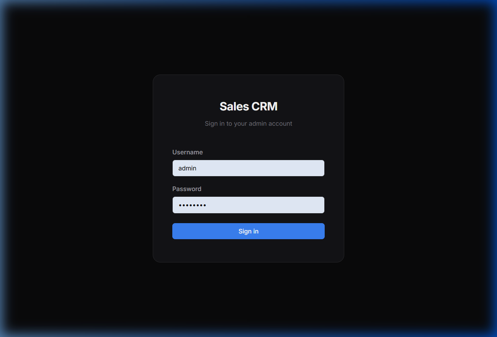
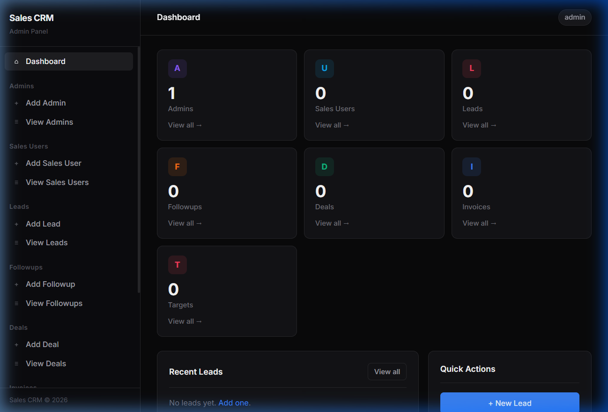
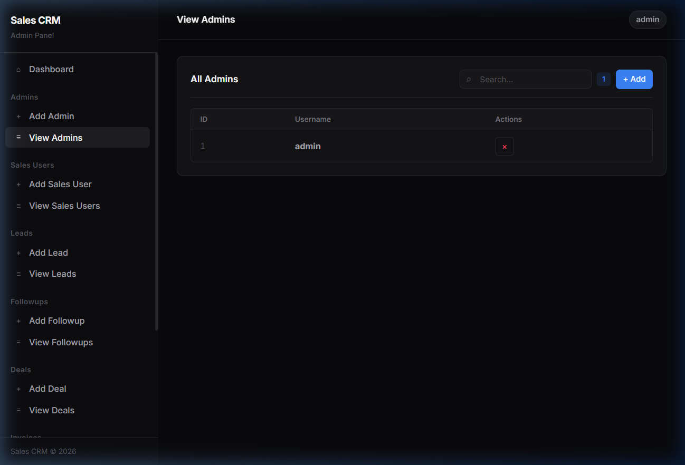
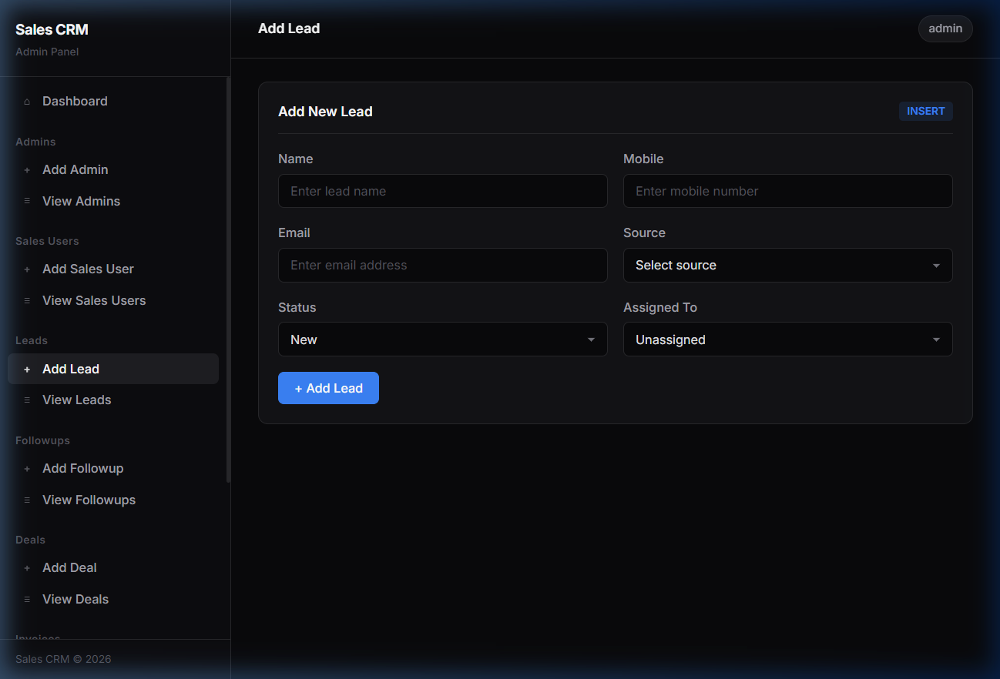
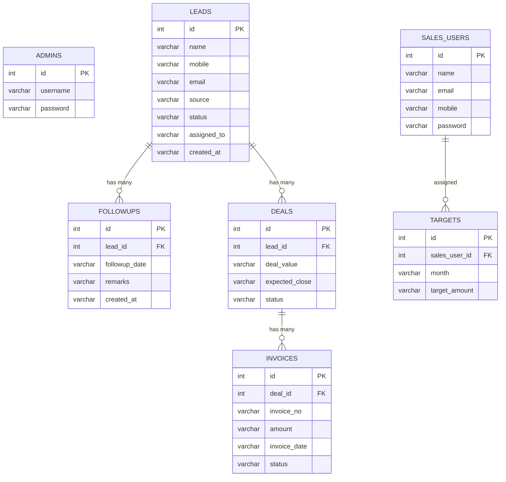
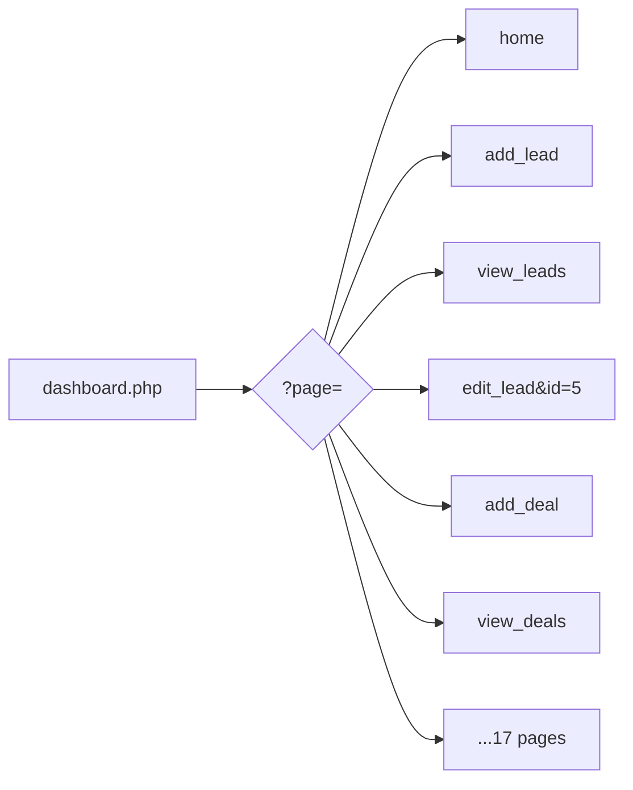
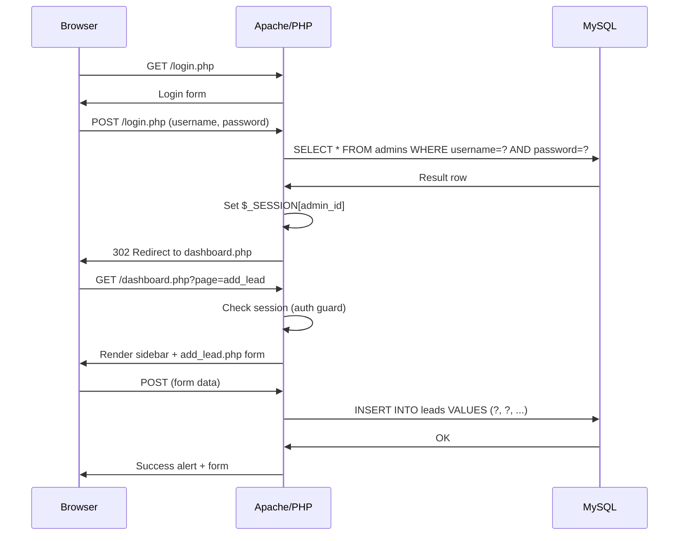

# Sales CRM Admin Panel

A **PHP/MySQL** web-based Sales CRM Admin Panel for managing sales users, leads, follow-ups, deals, invoices, and sales targets through a clean dark-themed dashboard.

---

## Screenshots

| Login | Dashboard |
|:-----:|:---------:|
|  |  |

| View Records | Add Records |
|:------------:|:-----------:|
|  |  |

---

## Features

- **Admin Authentication** — Secure login/logout with PHP sessions
- **Dashboard Home** — Live stat cards with real database counts, recent activity feed, quick actions
- **7 Add Modules** — Insert forms with validation (Admins, Sales Users, Leads, Followups, Deals, Invoices, Targets)
- **7 View Modules** — Searchable data tables with action buttons
- **3 Edit Modules** — Edit forms for Leads, Deals, and Invoices
- **Delete Records** — Delete any record with a confirmation modal
- **Search & Filter** — Instant client-side search on all view tables
- **Responsive Design** — Mobile sidebar toggle, adaptive grids
- **Clean Dark Theme** — Zinc-based palette, Inter font, no emojis

---

## Architecture

```
            +---------------------------------------------------+
            |                     Browser                        |
            |  Login Page -> Dashboard -> Pages (Add/View/Edit)  |
            +-------------------------+-------------------------+
                                      |
                                      | HTTP (Apache)
                                      |
            +-------------------------v-------------------------+
            |                   Apache / PHP                     |
            |                                                    |
            |  login.php    - Auth check against admins table     |
            |  dashboard.php - Layout + page router (?page=xxx)  |
            |  sidebar.php  - Navigation component               |
            |  pages/*.php  - 17 page modules (CRUD operations)  |
            |  config.php   - DB connection + session_start      |
            +-------------------------+-------------------------+
                                      |
                                      | MySQLi (Prepared Stmts)
                                      |
            +-------------------------v-------------------------+
            |                  MySQL (MariaDB)                   |
            |                  Database: sales_crm               |
            |                                                    |
            |  admins | sales_users | leads | followups          |
            |  deals  | invoices    | targets                    |
            +---------------------------------------------------+
```

---

## Database Schema & Relationships

### Entity Relationship Diagram



### Table Relationships

```
 ADMINS              SALES_USERS
 +------+            +------+
 | id   |            | id   |---+
 | user |            | name |   |
 | pass |            | email|   |
 +------+            +------+   |
                                |
 LEADS                          |    TARGETS
 +------+---+                   |    +------+
 | id   |   |---+              +----| user |
 | name |   |   |                   | month|
 | ...  |   |   |                   | amt  |
 +------+   |   |                   +------+
             |   |
    +--------+   +--------+
    |                      |
    v                      v
 FOLLOWUPS              DEALS
 +--------+             +--------+---+
 | id     |             | id     |   |
 | lead_id|             | lead_id|   |------+
 | date   |             | value  |   |      |
 | remarks|             | status |   |      |
 +--------+             +--------+   |      |
                                     |      |
                                     |      v
                                     |   INVOICES
                                     |   +--------+
                                     |   | id     |
                                     +---| deal_id|
                                         | inv_no |
                                         | amount |
                                         | status |
                                         +--------+
```

### Relationship Summary

| Parent | Child | Relationship | Join Key |
|--------|-------|-------------|----------|
| `leads` | `followups` | One-to-Many | `followups.lead_id = leads.id` |
| `leads` | `deals` | One-to-Many | `deals.lead_id = leads.id` |
| `deals` | `invoices` | One-to-Many | `invoices.deal_id = deals.id` |
| `sales_users` | `targets` | One-to-Many | `targets.sales_user_id = sales_users.id` |

---

## Page Routing

All pages are served through `dashboard.php` using a `?page=` query parameter:



| Route | Action | SQL |
|-------|--------|-----|
| `?page=home` | Dashboard with live stats | `SELECT COUNT(*)` on all tables |
| `?page=add_lead` | Insert form | `INSERT INTO leads (...)` |
| `?page=view_leads` | Table with search | `SELECT * FROM leads` |
| `?page=edit_lead&id=5` | Edit form | `UPDATE leads SET ... WHERE id=5` |
| `?delete=1&table=leads&id=5` | Delete handler | `DELETE FROM leads WHERE id=5` |

---

## Request Flow



---

## Project Structure

```
CRM/
├── config.php              # DB connection (mysqli) + session_start()
├── db_setup.sql            # CREATE DATABASE + 7 CREATE TABLE statements
├── login.php               # Auth page — checks admins table
├── logout.php              # session_destroy() + redirect
├── dashboard.php           # Main layout: sidebar + content router + delete handler
├── sidebar.php             # Left nav with section grouping
├── style.css               # Zinc dark theme — Inter font, clean components
├── script.js               # Search, delete modal, sidebar toggle
├── run.py                  # Auto-launcher: prechecks + starts services
├── README.md               # This file
├── .gitignore              # OS, IDE, Python cache exclusions
├── screenshots/            # App screenshots for README
│   ├── login.png
│   ├── dashboard.png
│   ├── view_admins.png
│   └── add_lead.png
└── pages/
    ├── add_admin.php        # INSERT -> admins
    ├── add_sales_user.php   # INSERT -> sales_users
    ├── add_lead.php         # INSERT -> leads
    ├── add_followup.php     # INSERT -> followups
    ├── add_deal.php         # INSERT -> deals
    ├── add_invoice.php      # INSERT -> invoices
    ├── add_target.php       # INSERT -> targets
    ├── view_admins.php      # SELECT <- admins
    ├── view_sales_users.php # SELECT <- sales_users
    ├── view_leads.php       # SELECT <- leads (with status badges)
    ├── view_followups.php   # SELECT <- followups JOIN leads
    ├── view_deals.php       # SELECT <- deals JOIN leads
    ├── view_invoices.php    # SELECT <- invoices
    ├── view_targets.php     # SELECT <- targets JOIN sales_users
    ├── edit_lead.php        # UPDATE -> leads
    ├── edit_deal.php        # UPDATE -> deals
    └── edit_invoice.php     # UPDATE -> invoices
```

---

## Tech Stack

| Layer | Technology |
|-------|------------|
| Backend | PHP 8.x |
| Database | MySQL / MariaDB |
| Frontend | HTML5, CSS3, JavaScript |
| Server | Apache (XAMPP) |
| Font | Inter (Google Fonts) |

---

## Quick Start

### Automatic (Recommended)

```bash
python run.py
```

The launcher will:
1. Verify XAMPP, PHP, and MySQL installation
2. Run PHP syntax checks on all files
3. Start MySQL and Apache services
4. Import the database schema
5. Create a junction link in htdocs
6. Open the app in your browser

### Manual Setup

**Prerequisites:** XAMPP installed at `C:\xampp`

```bash
# 1. Start Apache and MySQL from XAMPP Control Panel

# 2. Import database
C:\xampp\mysql\bin\mysql.exe -u root < db_setup.sql

# 3. Link project to htdocs
mklink /J "C:\xampp\htdocs\CRM" "d:\client\CRM"

# 4. Open browser
start http://localhost/CRM/login.php
```

### Default Login

| Field | Value |
|-------|-------|
| Username | `admin` |
| Password | `admin123` |

---

## How It Works

### Authentication
1. `login.php` checks credentials against the `admins` table using prepared statements
2. On success, stores `admin_id` and `admin_username` in `$_SESSION`
3. `dashboard.php` checks for session — redirects to login if missing
4. `logout.php` calls `session_destroy()` and redirects to login

### CRUD Operations
- **Create** — Add pages contain HTML forms. On POST, PHP validates input and runs `INSERT INTO` via `mysqli::prepare()`
- **Read** — View pages run `SELECT` queries (with `LEFT JOIN` for related data) and render HTML tables
- **Update** — Edit pages fetch a record by ID, pre-fill the form, and run `UPDATE` on submission
- **Delete** — Handled globally in `dashboard.php` via `?delete=1&table=xxx&id=xxx` with a confirmation modal

### Client-Side Features
- **Table Search** — JavaScript filters table rows in real-time as user types
- **Delete Modal** — Overlay confirmation prevents accidental deletions
- **Sidebar Toggle** — Mobile-responsive hamburger menu
- **Form Validation** — HTML5 `required` attributes + browser validation

---

## License

This project is for internal/educational use.
